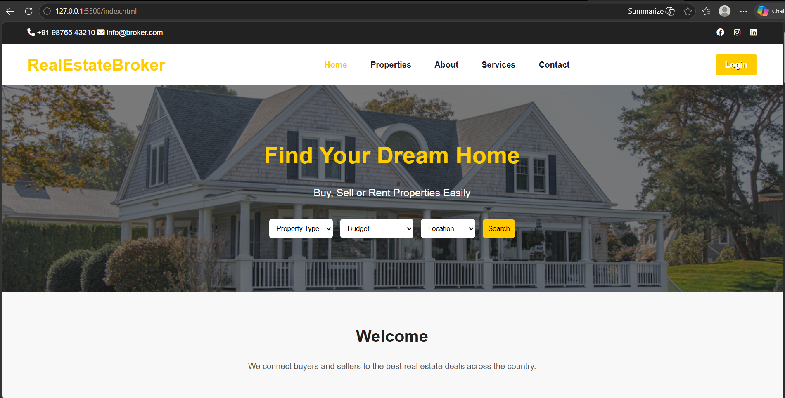
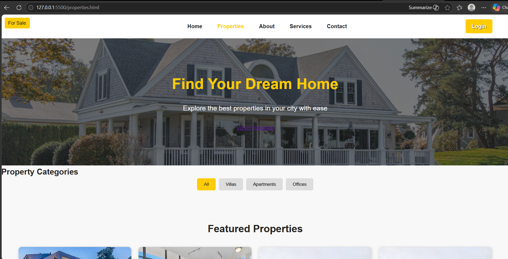
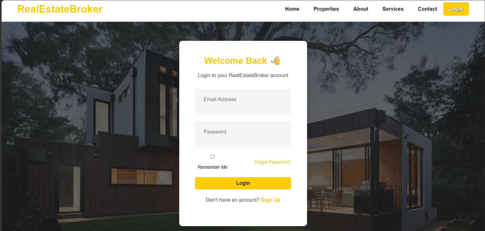

🏠 Real Estate Broker (Frontend Project)

🚀 This is a Real Estate Website UI built using HTML & CSS.
It showcases property listings, agents, offers, and other essential sections of a modern real estate platform.

📌 Features

✨ Modern Real Estate UI Design
✨ Property Listings (Villas, Apartments, Offices)
✨ Navigation Bar with Multiple Pages
✨ Hero Section with Call-to-Action
✨ Special Offers Section
✨ Agent Profiles
✨ Testimonials Section
✨ Blog / Articles Section
✨ Clean & Responsive Design

## 🛠️ Technologies Used
- HTML5
- CSS3
- Font Awesome

---

## 📂 Project Structure

real-estate-broker-frontend/
│
├── index.html
├── properties.html
├── about.html
├── services.html
├── contact.html
├── login.html
├── style.css
│
├── imgs/
│   ├── luxury-villa.png
│   ├── modern-apartment.png
│   ├── family-house.png
│   ├── villa-with-garden.png
│   └── seaside-apartment.png
│
├── assets/
│
└── README.md
📸 Preview
### 🏡 Home Page  

### 🏢 Properties Page  

### 🔐 Login Page  

🌐 Live Demo
👉 https://vijaymp1214.github.io/real-estate-broker-frontend/

💡 Future Improvements
Add JavaScript functionality (filters, interactions)
Improve mobile responsiveness
Add property search feature
Make contact form functional

🙌 Author
👤 Vijay Prajapati

⭐ Support
If you like this project, give it a ⭐ on GitHub!
